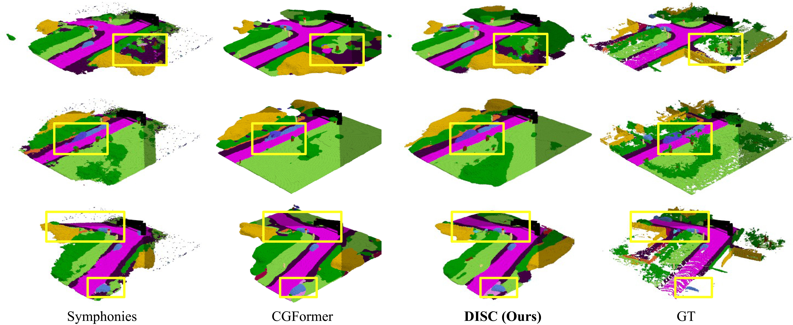
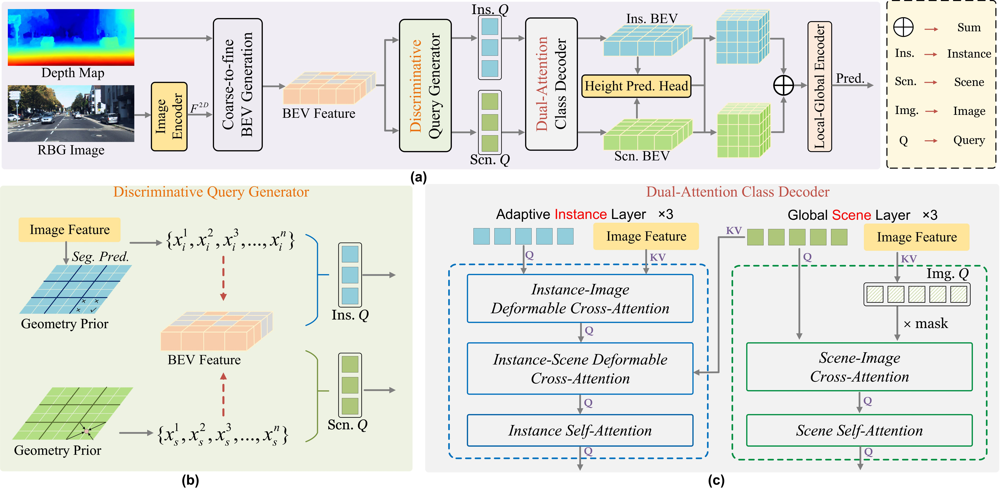
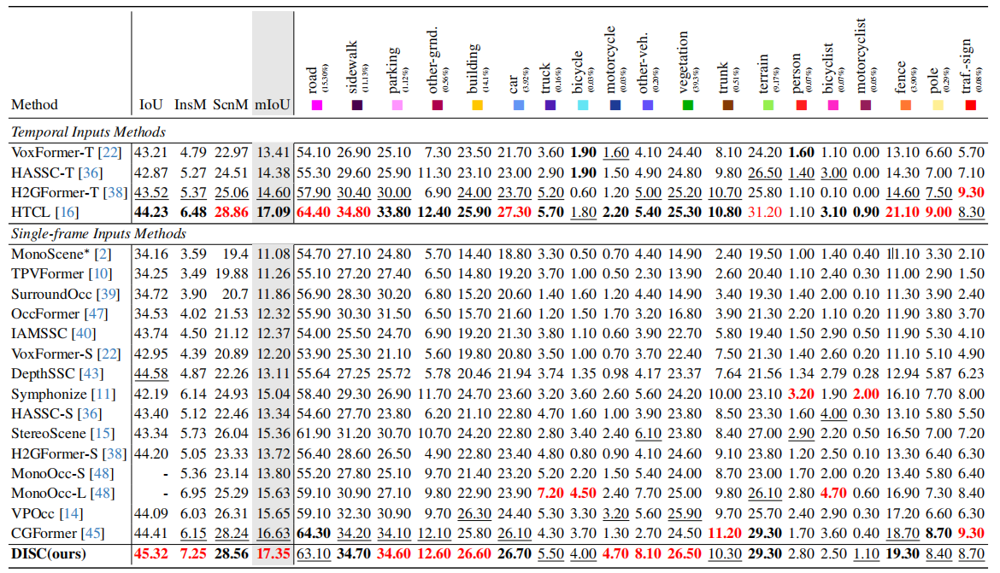
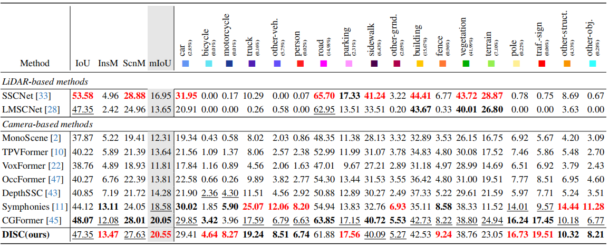

# **Disentangling Instance and Scene Contexts for 3D Semantic Scene Completion**



## 🚀 News

- **2025.6.xxxx** code released
- **2025.6.xxxx** [**arXiv**](https://arxiv.org/abs/2405.13675) preprint released

## Introduction

3D Semantic Scene Completion (SSC) has gained increasing attention due to its pivotal role in 3D perception. Recent advancements have primarily focused on refining voxel-level features to construct 3D scenes. However, treating voxels as the basic interaction units inherently limits the utilization of class-level information, which is proven critical for enhancing the granularity of completion results. To address this, we propose **D**isentangling **I**nstance and **S**cene **C**ontexts (**DISC**), a novel dual-stream paradigm that enhances learning for both instance and scene categories through separated optimization. Specifically, we replace voxel queries with discriminative class queries, which incorporate class-specific geometric and semantic priors. Additionally, we exploit the intrinsic properties of classes to design specialized decoding modules, facilitating targeted interactions and efficient class-level information flow. Experimental results demonstrate that DISC achieves state-of-the-art (SOTA) performance on both SemanticKITTI and SSCBench-KITTI-360 benchmarks, with mIoU scores of 17.35 and 20.55, respectively. Remarkably, DISC even outperforms multi-frame SOTA methods using only single-frame input and significantly improves instance category performance, surpassing both single-frame and multi-frame SOTA instance mIoU by **17.9%** and **11.9%**, respectively, on the SemanticKITTI hidden test.

## Method



**The overall architecture.** (a) DISC is a novel semantic scene completion method with a dual-stream framework for specialized instance and scene categories processing. (b) The Discriminative Query Generator (DQI) integrates geometric and contextual priors into instance and scene queries based on category attributes. (c) Details of the Adaptive Instance Layer (AIL) and the Global Scene Layer (GSL), which address the distinct challenges faced by instance and scene categories during the reconstruction process in a differentiated manner. For clarity, the Feed-Forward Network (FFN) and positional embedding are omitted in the figure.

## Quantitative Results



Table 1. **Quantitative results on SemanticKITTI test**.  Among all methods, the top three ranked approaches are marked as <font color=red>**red**</font>, **bold**, and <u>underlined</u>. For single-frame methods, DISC achieves SOTA performance in mIoU, IoU, InsM, and ScnM. Notably, using only single-frame input, DISC surpasses even multi-frame SOTA methods in mIoU, IoU, and InsM.



Table 2. **Quantitative results on SSCBench-KITTI360 test**. Among all methods, the top three ranked approaches are marked as <font color=red>**red**</font>, **bold**, and <u>underlined</u>. DISC achieves SOTA results in mIoU and InsM, while surpassing LiDAR-based methods across multiple category-specific metrics.

## Getting Started

### Step 1. Installation

1. Install PyTorch and Torchvision.

2. Install MMDetection.

3. Install the rest of the requirements with pip.

   ```
   pip install -r requirements.txt
   ```
4. Download the pre-trained models of maskdino and swin, and place them in the pretrain folder.

### Step 2. Dataset Preparation

Please refer to [Symphonies](https://github.com/hustvl/Symphonies) to complete the preparation of SemanticKitti and Kitti-360 datasets. Also, modify the corresponding path configurations in configs/datasets.

### Step 3. Training and Inference

1. **Setup**

   ```bash
   export PYTHONPATH=`pwd`:$PYTHONPATH
   ```

2. **Training**

   ```bash
   python tools/train.py 
   ```

3. **Testing**

   Generate the outputs for submission on the evaluation server

   ```bash
   python tools/test.py
   ```

## Model Zoo

We provide the pretrained weights on SemanticKITTI and KITTI360 datasets, reproduced with the released codebase.

|                      Dataset                       |    Backbone    |        IoU         |        mIoU        |                        Model Weights                         |                        Training Logs                         |
| :------------------------------------------------: | :------------: | :----------------: | :----------------: | :----------------------------------------------------------: | :----------------------------------------------------------: |
| [SemanticKITTI](configs/semantickitti_CGFormer.py) | EfficientNetB7 | 44.41, 45.99 (val) | 16.63, 16.89 (val) | [Link](https://github.com/pkqbajng/CGFormer/releases/download/v1.0/CGFormer_semantickitti.ckpt) | [Link](https://github.com/pkqbajng/CGFormer/releases/download/v1.0/CGFormer_semantickitti_logs.zip) |
|   [KITTI360](configs/semantickitti_CGFormer.py)    | EfficientNetB7 |       48.07        |       20.05        | [Link](https://github.com/pkqbajng/CGFormer/releases/download/v1.0/CGFormer_kitti360.ckpt) | [Link](https://github.com/pkqbajng/CGFormer/releases/download/v1.0/CGFormer_kitti360_logs.zip) |

## Acknowledgement

Many thanks to these exceptional open source projects:
- [Symphonize](https://github.com/hustvl/Symphonies.git)
- [mmdet3d](https://github.com/open-mmlab/mmdetection3d)

As it is not possible to list all the projects of the reference papers. If you find we leave out your repo, please contact us and we'll update the lists.

## Bibtex

If you find our work beneficial for your research, please consider citing our paper and give us a star:

```

```

If you encounter any issues, please contact **xxxxxxxxxxxxxxxxxxxxxxxxx**.
